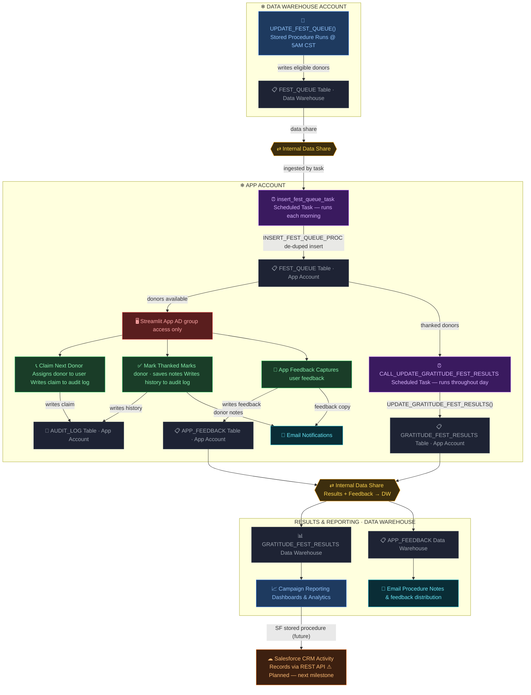

# Gratitude Fest — Technical Architecture

> End-to-end data flow across two Snowflake accounts — from donor eligibility through real-time thanking to Salesforce Activity records.

| | |
|---|---|
| **Accounts** | Data Warehouse ← internal data share → App Account |
| **Queue refresh** | Daily at 5:00 AM CST |
| **Interface** | Streamlit in Snowflake (AD-restricted) |

---

## System Diagram

---

## Flow Walkthrough

### Step 01 — Donor Queue Generation
Each active campaign day at 5:00 AM CST, `UPDATE_FEST_QUEUE()` evaluates donor eligibility and writes qualified records to `FEST_QUEUE` in the Data Warehouse.

**Objects:** `UPDATE_FEST_QUEUE()` · `FEST_QUEUE` (Data Warehouse)

---

### Step 02 — Internal Data Share
The Data Warehouse queue table is shared to the App Account via Snowflake's internal data sharing. `insert_fest_queue_task` runs each morning, calling `INSERT_FEST_QUEUE_PROC` to ingest new records with de-duplication.

**Objects:** `insert_fest_queue_task` · `INSERT_FEST_QUEUE_PROC` · Internal Data Share

---

### Step 03 — Streamlit App Interface
Users access the Streamlit app in the App Account. Access is restricted to an Active Directory group. Three stored procedures power all user actions.

**Objects:** Streamlit in Snowflake · Active Directory group

---

### Step 04 — Three Core Procedures
- **Claim Next Donor** — assigns a donor to the requesting user and logs the claim.
- **Mark Thanked** — marks the donor, saves notes, writes audit history, and sends notes by email.
- **App Feedback** — captures in-app feedback and sends a copy by email.

**Objects:** `CLAIM_NEXT()` · `MARK_THANKED()` · `SUBMIT_FEEDBACK()` · `AUDIT_LOG` · `APP_FEEDBACK`

---

### Step 05 — Results Processing
`CALL_UPDATE_GRATITUDE_FEST_RESULTS` runs throughout the day, moving thanked donors into `GRATITUDE_FEST_RESULTS`. When no active campaign dates remain, all remaining queue records are finalized into the results table.

**Objects:** `CALL_UPDATE_GRATITUDE_FEST_RESULTS` task · `UPDATE_GRATITUDE_FEST_RESULTS()` · `GRATITUDE_FEST_RESULTS`

---

### Step 06 — Results → Data Warehouse
`GRATITUDE_FEST_RESULTS` and `APP_FEEDBACK` are shared back to the Data Warehouse account via a second internal data share. Reporting dashboards and the email distribution procedure are built on these tables.

**Objects:** Internal Data Share · `GRATITUDE_FEST_RESULTS` (DW) · `APP_FEEDBACK` (DW)

---

### Step 07 — Salesforce Integration *(Planned)*
A future stored procedure will read from `GRATITUDE_FEST_RESULTS` and call the Salesforce REST API to write an Activity record for every account that was thanked — closing the loop in CRM.

**Objects:** SF Activity Procedure *(not yet built)* · Salesforce REST API

---

## Stored Procedure Reference

| Procedure | Trigger | Actions | Outputs |
|---|---|---|---|
| `Claim Next Donor` | User clicks "Claim Next Donor" in Streamlit | Selects next available donor from `FEST_QUEUE` and assigns to the requesting user | Claim written to `AUDIT_LOG` |
| `Mark Thanked` | User marks a donor as thanked | Marks donor in queue (preventing reassignment), saves notes, writes full activity history to audit log, sends notes via email | `FEST_QUEUE` updated · `AUDIT_LOG` entry · Email notification |
| `App Feedback` | User submits in-app feedback form | Writes feedback record to `APP_FEEDBACK` table, triggers email notification with feedback content | `APP_FEEDBACK` record · Email notification |
| `INSERT_FEST_QUEUE_PROC` | Called by `insert_fest_queue_task` each morning | Reads from DW data share, inserts any donors not already present in App Account `FEST_QUEUE` | `FEST_QUEUE` (App Account) populated |
| `UPDATE_GRATITUDE_FEST_RESULTS` | Called by `CALL_UPDATE` task throughout the day | Moves thanked donors to results table during campaign; finalizes all records when no active dates remain | `GRATITUDE_FEST_RESULTS` populated |
| `SF Activity Procedure` *(Planned)* | Post-campaign trigger (TBD) | Reads `GRATITUDE_FEST_RESULTS`, calls Salesforce REST API to create an Activity record per thanked account | Salesforce Activity records |

---

*Salesforce integration — next milestone*
